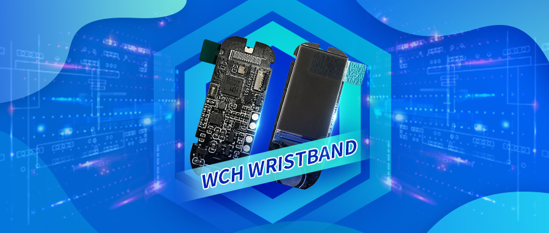

# WCH Wristband

[EN](README.md) | 中文

> 基于CH582M芯片设计的智能手环Demo。
>
> 支持BLE 5.2，心率检测，血氧检测，姿态角检测，触摸按键以及WCH-Link调试。
>
> 硬件提供原理图PCB参考设计，软件提供基本传感器外设驱动。

### 项目文件说明

------

- Hardware：wristband为原理图和PCB文件，使用Altium Designer打开；pcblib为相关器件的原理图PCB库。
- Firmware：CH582M芯片的固件，使用沁恒开发的IDE MounRiver Studio打开。
- Doc：CH582M芯片的手册以及相关外设的手册。
- Pic：图片生成工具以及工程使用图片。

### 硬件方案

------

- 主控芯片采用CH582M芯片，32位RISC-V架构MCU，自带BLE5.2

- LCD屏采用0.96寸高清IPS显示屏 ST7735，I2C DMA传输
- 采用MUP9250九轴传感器，具备抬腕检测，步数计算等功能
- 血氧心率检测模块MAX30102
- DRV2605电机驱动模块，实现震动功能
- TTP223触摸按键

### 软件设计

------

- 基于沁恒MRS IDE开发

- 提供SPI  I2C读写函数
- 提供各个功能模块功能函数

